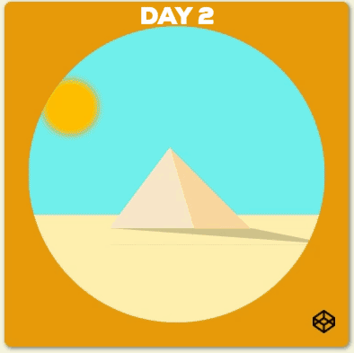

# Day 2 Sun Rises

## Introduction

It is a animation of sun and moon rise and set.

Here is the website: [Day 2- Sun Rises](https://louuu03.github.io/EverydayLilChallenge/D2-SunRises/index.html)





## Technologies

Mainly CSS, plus some HTML.


## HighLights

* ``` clip-path ```: 
    to make things in a shape you want.

* ``` transform-origin ``` and ``` transform: rotate() ```:
    to rotate with the center that you set


## Problem faced

N/A