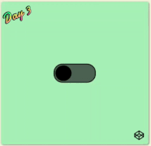

# Day 3 Toggle Button
## Introduction
It is a animation of a toggle button that rotates after clicking on it.

Here is the website: [Day 3- Toggle Button](https://louuu03.github.io/EverydayLilChallenge/D3-ToggleButton/index.html)





## Technologies
Mainly CSS, plus some HTML and JavaScript.


## HighLights
* ``` overflow: hidden ``` :
    Clip off the unwanted part of a child once it exceed the parent.
* ``` classList.add ``` and  ``` classList.remove ```:
    It doesn't affect the class you add itself.
    so I add a ``` <div class='all'> ``` to call


## Problem faced
N/A