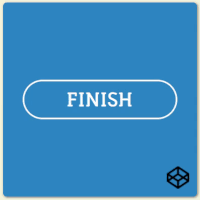

# Day 4 Finish Button
## Introduction
It is a animated finish button.

Here is the website: [Day 4- Finish Button](https://louuu03.github.io/EverydayLilChallenge/D4-FinishButton/index.html)





## Technologies
Mainly CSS, plus some HTML and JavaScript.


## HighLights
* Concept of SVG and SVG circle.
*  ``` stroke-dashoffset``` and ``` stroke-dasharray```


## Problem faced
* It seems that ``` classList.add ``` and  ``` classList.remove ``` can't add SVG directly.
