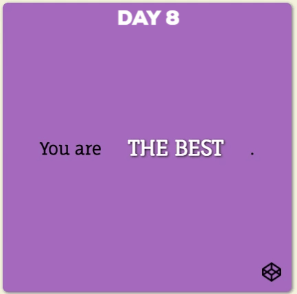

# Day 8 Validation

## Introduction

My closed ones always say that I don't really give out enough affirmation and validation to them.
I do appriciate and admire them, just not in an explicit way.
So here you go, this is a carousel of those validation.

Here is the website: [Day 8- Validation](https://louuu03.github.io/EverydayLilChallenge/D8-Validation/index.html)





## Technologies

Mainly Javascript, plus some HTML and Css.


## HighLights

* Using ```setTimeout``` with ```for``` loop to let the words in the carousel change with a certain interval.


## Problem faced

N/A
